# Industry App Classifying & Grading

**IACG** is an experimental B/S system for industry app classifying and grading.

- This is the source codes of my programming assignment of SE2019 courses.

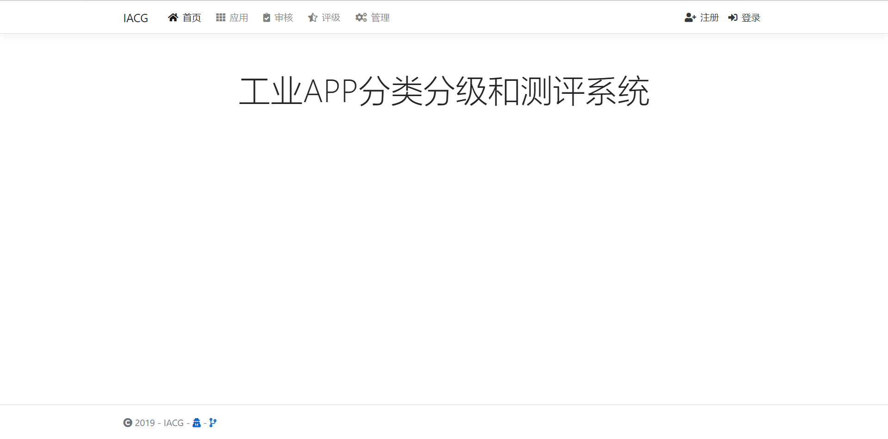

## Features

### Register & Login

- Register (as different roles)

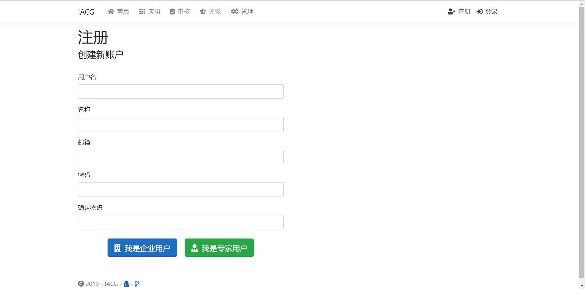

- Login

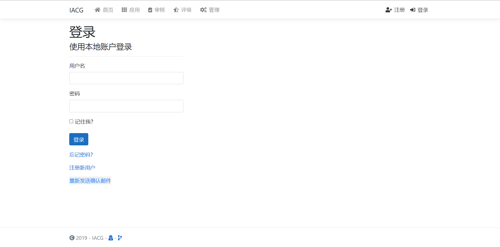

### User Profile Manage

- Profile

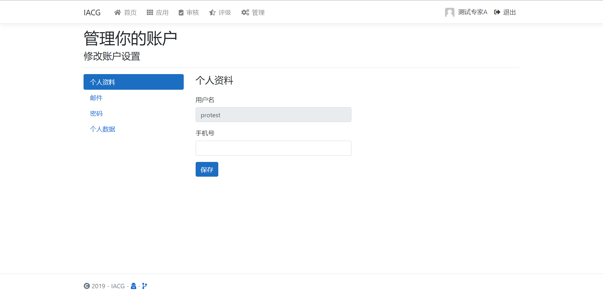

- Manage

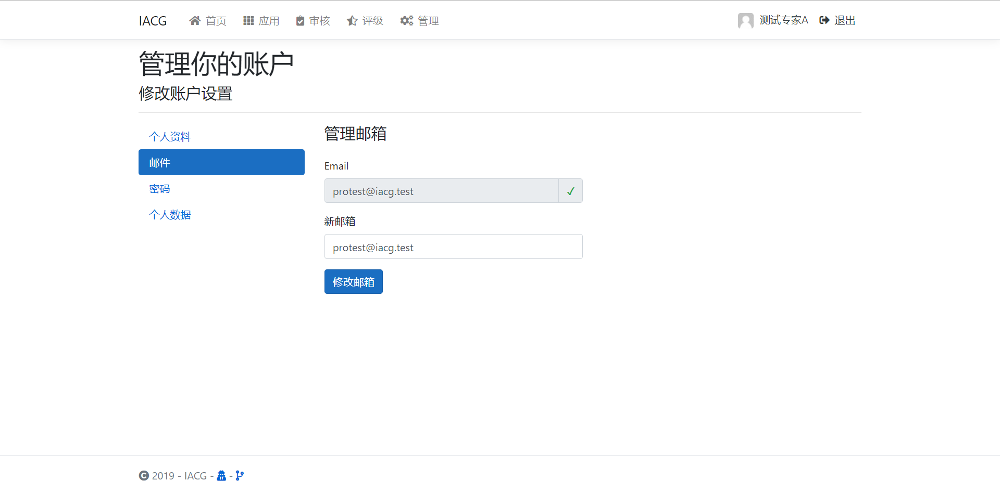

- Password

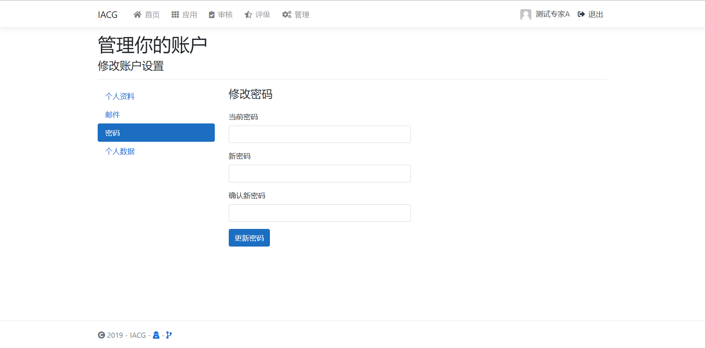

- Personal data

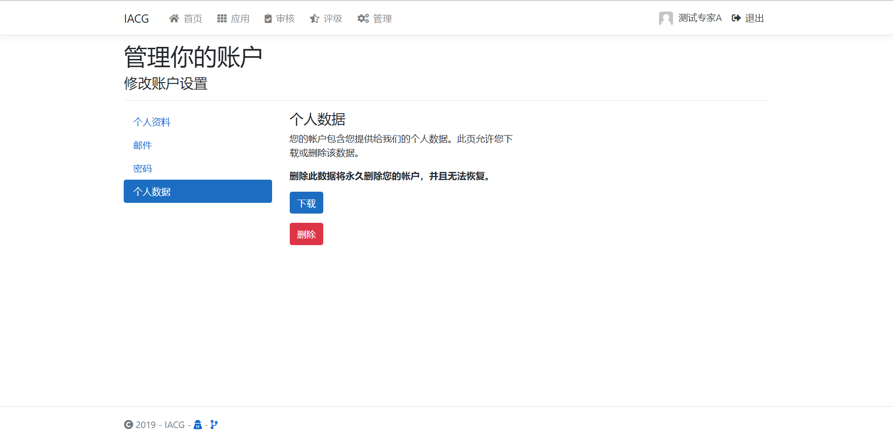

- Delete account

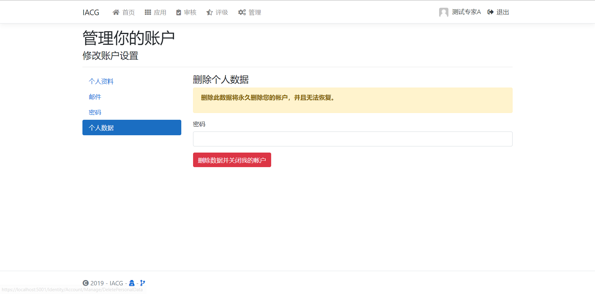

### App Manage & Review

- View apps

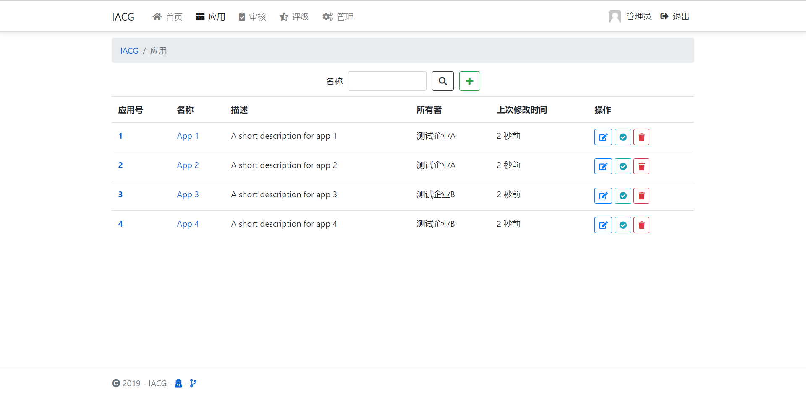

- View reviews

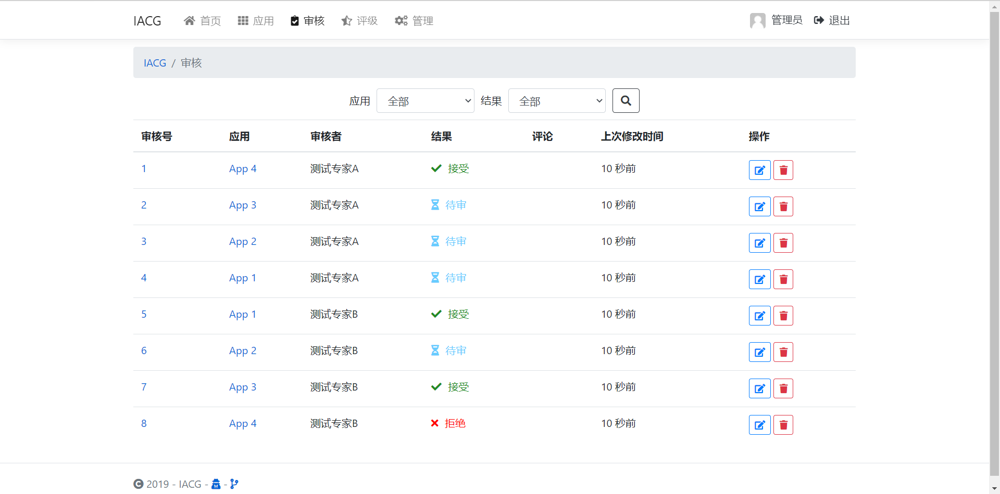

- App details

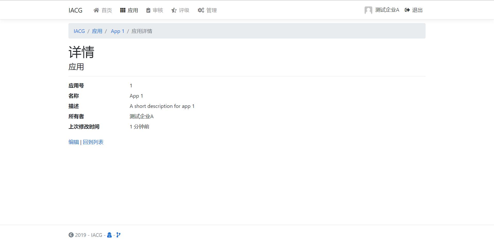

- Edit apps

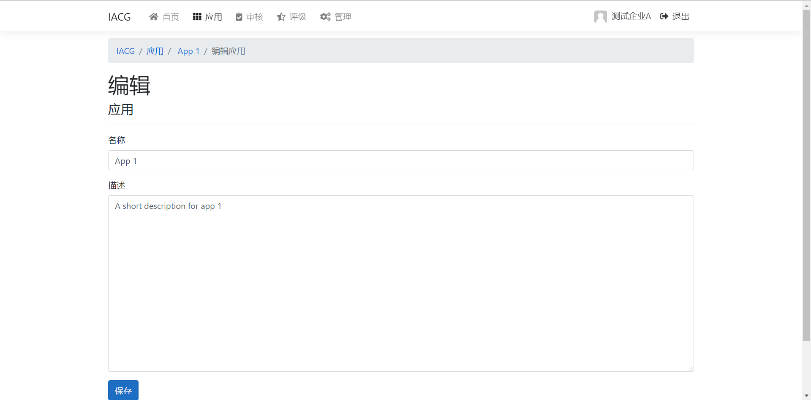

- Delete apps

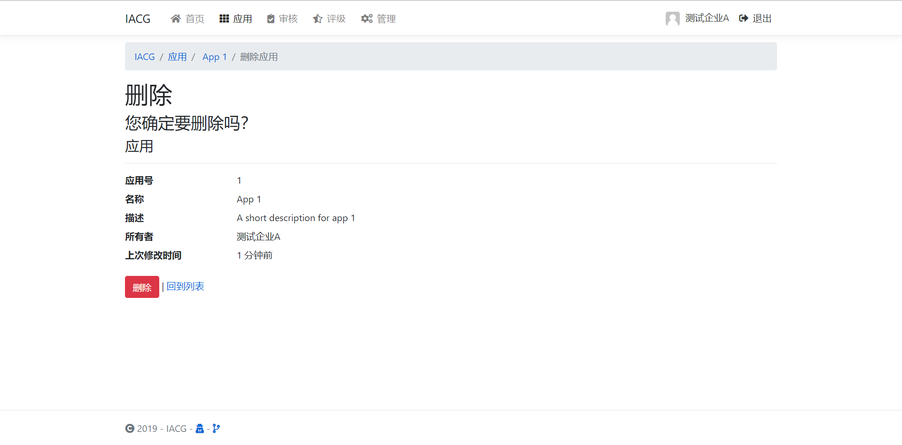

- Create apps

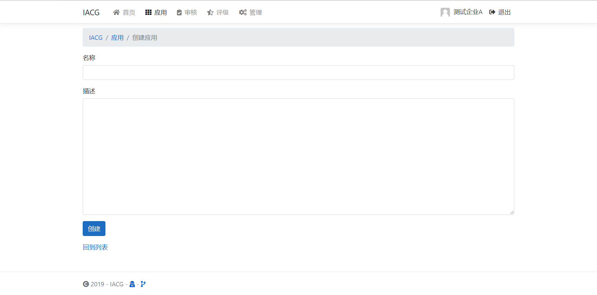

- Review apps

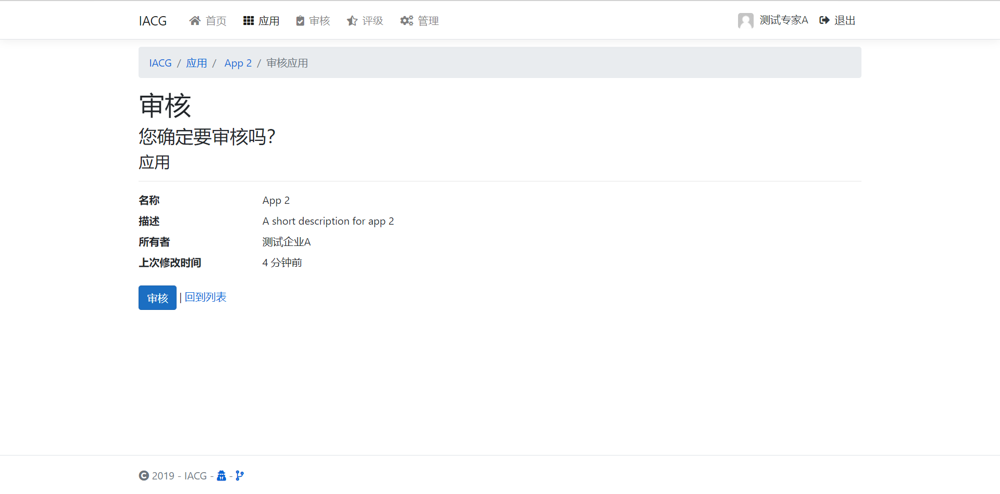

- Review details

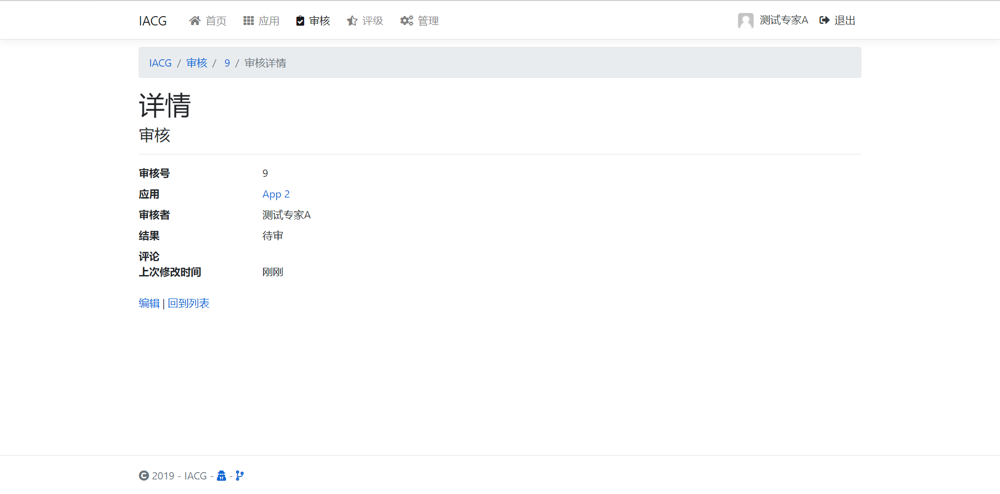

- Edit reviews

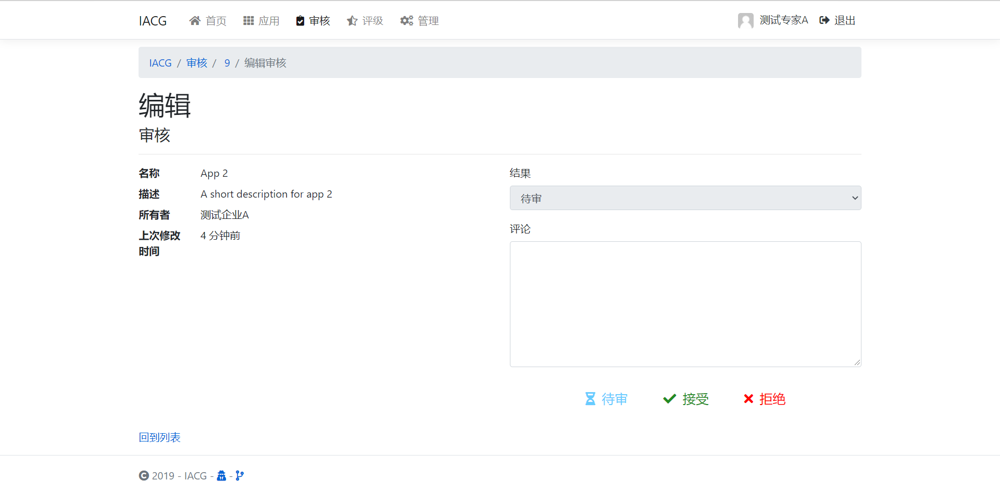

- Delete reviews

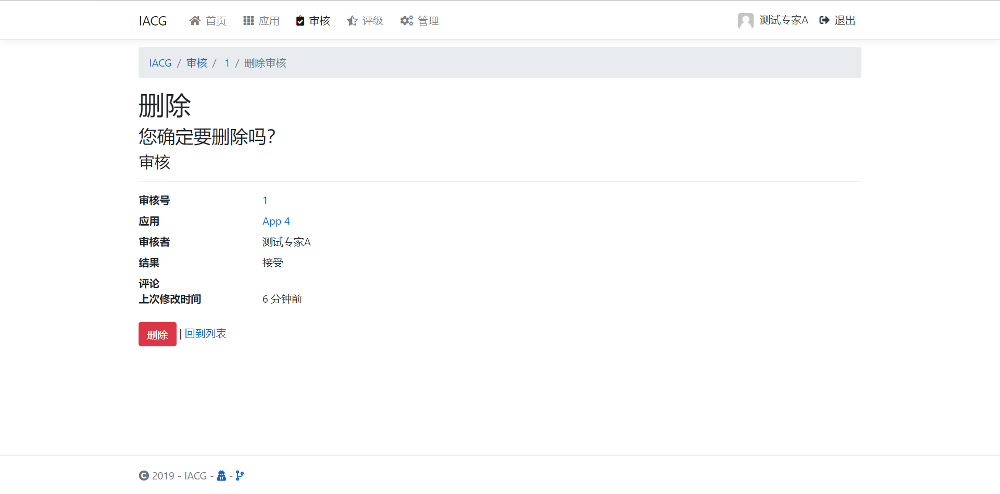

## Dependences

- .NET Core 3.0
- ASP.NET Core 3.0
- EntityFramework Core 3.0
- MS SQL Server

## Development

Use Visual Studio Community 2019 (v16.3.10) with "ASP.NET and Web Development" workload.

Open `IACG.sln` in VS and press `F5`. It takes time to restore libraries and front-end packages.

Then visit `https://localhost:5001/` or `http://localhost:5000` to view the website. 

Seed data (all password is 123456):
- Admin user:
  - admin
- Enterprise user:
  - enttest
  - enttest2
- Professional user
  - protest
  - protest2
